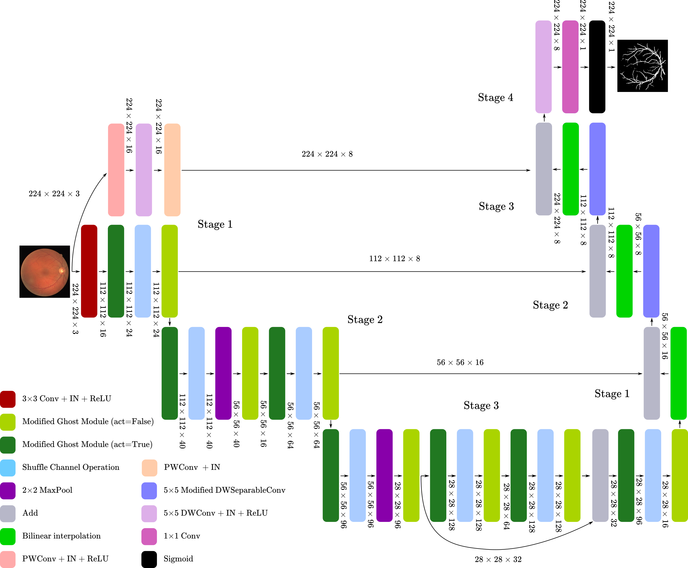

# MSGNet: Modified MobileNet-ShuffleNet-GhostNet Network for Lightweight Retinal Vessel Segmentation

This is the official implementation of [MSGNet: Modified MobileNet-ShuffleNet-GhostNet Network for Lightweight Retinal Vessel Segmentation](https://ieeexplore.ieee.org/abstract/document/10276687), presented in ICITACEE 2023.




## Requirements

```
pip install -r requirements.txt
```


## Citation

### Plain Text

```
R. D. H. Al-Fahsi, A. Aqthobirrobbany, I. Ardiyanto and H. A. Nugroho, "MSGNet: Modified MobileNet-ShuffleNet-GhostNet Network for Lightweight Retinal Vessel Segmentation," 2023 10th International Conference on Information Technology, Computer, and Electrical Engineering (ICITACEE), Semarang, Indonesia, 2023, pp. 94-99, doi: 10.1109/ICITACEE58587.2023.10276687.
```

### BibTex

```
@INPROCEEDINGS{10276687,
  author={Al-Fahsi, Resha Dwika Hefni and Aqthobirrobbany, Aqil and Ardiyanto, Igi and Nugroho, Hanung Adi},
  booktitle={2023 10th International Conference on Information Technology, Computer, and Electrical Engineering (ICITACEE)}, 
  title={MSGNet: Modified MobileNet-ShuffleNet-GhostNet Network for Lightweight Retinal Vessel Segmentation}, 
  year={2023},
  volume={},
  number={},
  pages={94-99},
  doi={10.1109/ICITACEE58587.2023.10276687}}
```
